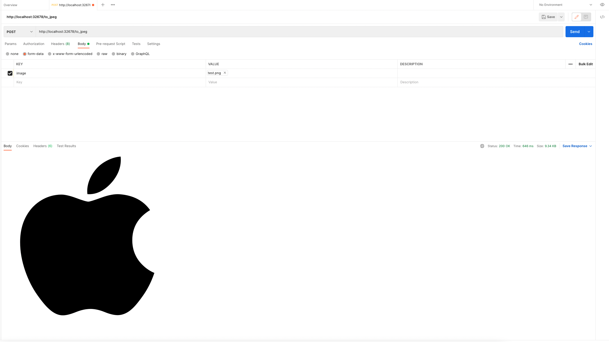

## Objective

To create an HTTP API server that allow users to upload PNG image and return a JPEG format file on responses.

## Prerequisites

[node](https://nodejs.org/en/) v16.15.0 or newer.

## Installation

Download dependencies

```
npm install
```

Run development server

```
npm run dev
```

Run Production server

```
npm run build
npm run start
```

Run linter

```
npm run lint
```

Run Test cases

```
npm run test
```

## Demo

```
curl --location --request POST 'http://localhost:32678/to_jpeg' \
--form 'image=@"<image path on your pc>"'
```

Exmaple response


